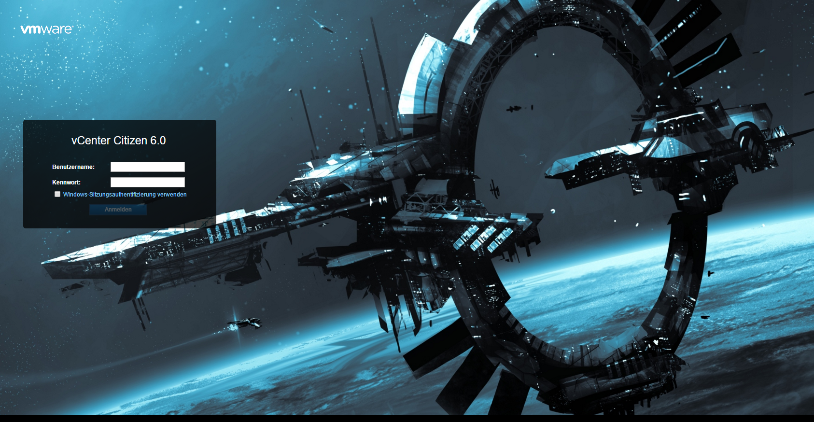

# VMware Web Client 6 Themes

## Requirements

 * At least VMware vCenter 6.0
 * File access to replace theme files

## Installation
Put the theme folder with the existing directory structure in the right directory.

**VMware Windows vCenter Server 6.0**

    C:\ProgramData\VMware\vCenterServer\runtime\VMwareSTSService\webapps\websso\

**VMware vCenter Server Appliance 6.0**

    /usr/lib/vmware-sso/vmware-sts/webapps/websso/

(One way to transfer the theme files on the VCSA is to enable SFTP access on the VCSA. How this can be done, you may find out here: "[vCSA 6.0 tricks: shell access, password expiration and certificate warnings](http://www.v-front.de/2015/03/vcsa-60-tricks-shell-access-password.html)".)

## Information

For more information how to customize the web client check out [the article "How to customize the new vSphere 6.0 Web Client login UI?"](http://www.virtuallyghetto.com/2015/02/how-to-customize-the-new-vsphere-6-0-web-client-login-ui.html) by [William Lam](http://twitter.com/lamw).

More themes by other people are available at...
 * [github.com/lamw/customize-vsphere-web-client-6.0](https://github.com/lamw/customize-vsphere-web-client-6.0)

## Themes
**StarCitizen01**: [6.0 and up](https://github.com/patschi/vmware-web-client-themes/tree/master/themes/starcitizen1/6.0), [6.0 U2 and up](https://github.com/patschi/vmware-web-client-themes/tree/master/themes/starcitizen1/6.0u2)

